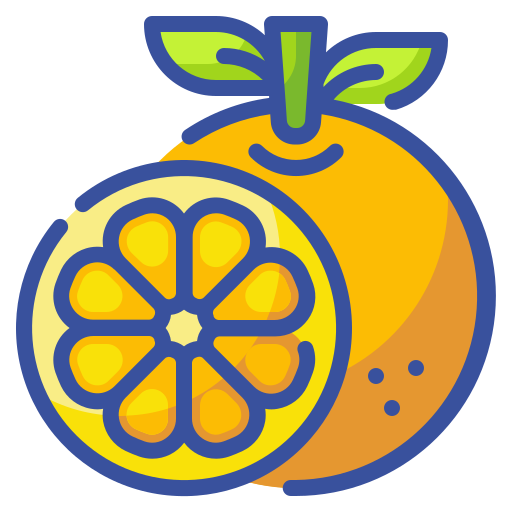

<div align = "center"></div>

<div align = "center">
  <h1>Carton.cr - HTTP Proxy Client with Server</h1>
</div>

<p align="center">
  <a href="https://crystal-lang.org">
    </a>
  <a href="https://travis-ci.org/636f7374/carton.cr">
    </a>
  <a href="https://github.com/636f7374/carton.cr/releases">
    </a>
  <a href="https://github.com/636f7374/carton.cr/blob/master/license">
    </a>
</p>

## Description

* a Reliable HTTP Proxy Client and Server, Easy to use.
  * Client and server using pluggable design, Easy for you to adjust.
  * Crystal native DNS resolver, faster and more stable.
  * It also supports the expansion Man-in-the-middle Toolkit.
* It is faster than the same type of shard.
  * [spider-gazelle / connect-proxy](https://github.com/spider-gazelle/connect-proxy)
  * [mamantoha / http_proxy](https://github.com/mamantoha/http_proxy)
  * These designs did not meet my project standards, so I redesigned it.
* If you want to use SOCKS5? I have successfully developed.
  * [⛵️ Available - Crystal SOCKS5 Client and Server](https://github.com/636f7374/herbal.cr)

## Features

* It is a full-featured HTTP Proxy Client / Server.
  * SimpleAuth (Does not support Bearer, Digest, HOBA, Mutual, AWS4-HMAC-SHA256).
  * Crystal native DNS Resolver.
  * Reject Establish (Server).
  * Supports extensible Man-in-the-middle Toolkit.
* Loosely coupled, Low footprint, High performance.
  * Pluggable design
* ...

## Tips

* Why is it named `Carton.cr`? it's just random six-word English words.

## Usage

* Simple Client

```crystal
require "carton"

# Durian
servers = [] of Tuple(Socket::IPAddress, Durian::Protocol)
servers << Tuple.new Socket::IPAddress.new("8.8.8.8", 53_i32), Durian::Protocol::UDP
servers << Tuple.new Socket::IPAddress.new("1.1.1.1", 53_i32), Durian::Protocol::UDP
resolver = Durian::Resolver.new servers
resolver.ip_cache = Durian::Cache::IPAddress.new

# Carton
begin

  client = Carton::Client.new "0.0.0.0", 1234_i32, resolver

  # Authentication (Optional)
  # client.authentication = Carton::Authentication::Basic
  # client.on_auth = Carton::AuthenticationEntry.new "admin", "abc123"

  # Handshake
  client.connect! "www.example.com", 80_i32

  # Write Payload
  request = HTTP::Request.new "GET", "www.example.com:80"
  request.header_host = "www.example.com:80"
  request.to_io client

  # Read Payload
  buffer = uninitialized UInt8[4096_i32]
  length = client.read buffer.to_slice

  STDOUT.puts [:length, length]
  STDOUT.puts String.new buffer.to_slice[0_i32, length]
rescue ex
  STDOUT.puts [ex]
end

client.try &.close

```

* Simple Server

```crystal
require "carton"

def handle_client(context : Carton::Context)
  STDOUT.puts context.stats

  context.perform
end

# Durian
servers = [] of Tuple(Socket::IPAddress, Durian::Protocol)
servers << Tuple.new Socket::IPAddress.new("8.8.8.8", 53_i32), Durian::Protocol::UDP
servers << Tuple.new Socket::IPAddress.new("1.1.1.1", 53_i32), Durian::Protocol::UDP
resolver = Durian::Resolver.new servers
resolver.ip_cache = Durian::Cache::IPAddress.new

# Carton
tcp_server = TCPServer.new "0.0.0.0", 1234_i32
carton = Carton::Server.new tcp_server, resolver
carton.authentication = Carton::Authentication::None
carton.client_timeout = Carton::TimeOut.new
carton.remote_timeout = Carton::TimeOut.new

# Authentication (Optional)
# carton.authentication = Carton::Authentication::Basic
# carton.on_auth = ->(user_name : String, password : String) do
#  STDOUT.puts [user_name, password]
#  Carton::Verify::Pass
# end

loop do
  socket = carton.accept?

  spawn do
    next unless client = socket
    next unless context = carton.upgrade client

    handle_client context
  end
end

```

```crystal
STDOUT.puts context.stats # => Carton::Stats(@clientAuthentication=Basic, @remoteAddress=#<Carton::RemoteAddress:0x10c76cc20 @address="www.google.com", @port=80>, @requestPayload=#<HTTP::Request:0x10c773cb0 @method="GET", @headers=HTTP::Headers{"Host" => "www.google.com", "Proxy-Authorization" => "Basic YWRtaW46YWJjMTIz", "User-Agent" => "curl/7.68.0", "Accept" => "*/*", "Proxy-Connection" => "Keep-Alive"}, @body=nil, @version="HTTP/1.1", @cookies=nil, @query_params=nil, @uri=nil, @remote_address=nil, @expect_continue=false, @resource="http://www.google.com/">, @trafficType=HTTP, @tunnelMode=false)
```

### Used as Shard

Add this to your application's shard.yml:
```yaml
dependencies:
  carton:
    github: 636f7374/carton.cr
```

### Installation

```bash
$ git clone https://github.com/636f7374/carton.cr.git
```

## Development

```bash
$ make test
```

## Credit

* [\_Icon::Wanicon/ProductsPackaging](https://www.flaticon.com/packs/products-packaging)

## Contributors

|Name|Creator|Maintainer|Contributor|
|:---:|:---:|:---:|:---:|
|**[636f7374](https://github.com/636f7374)**|√|√||

## License

* GPLv3 License
